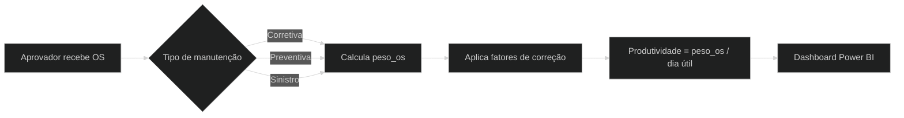
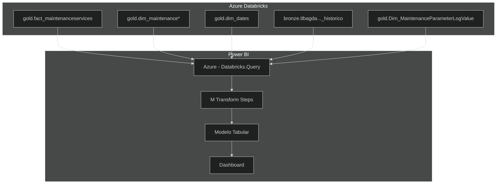
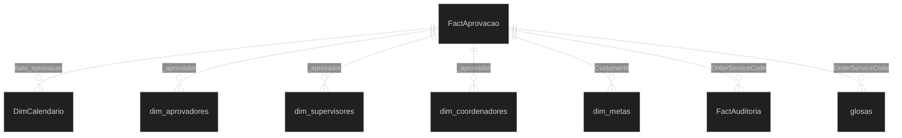
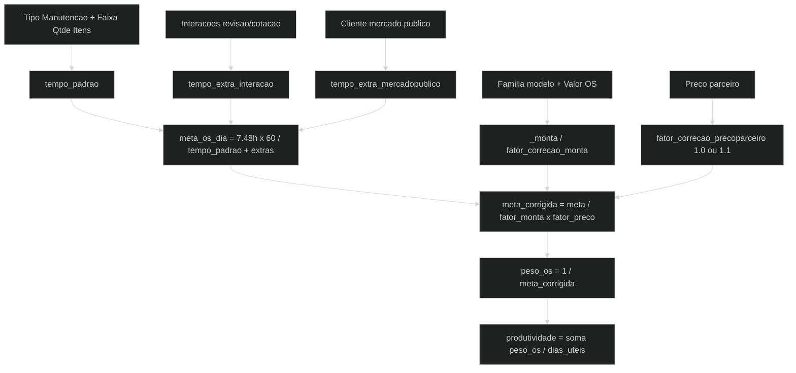
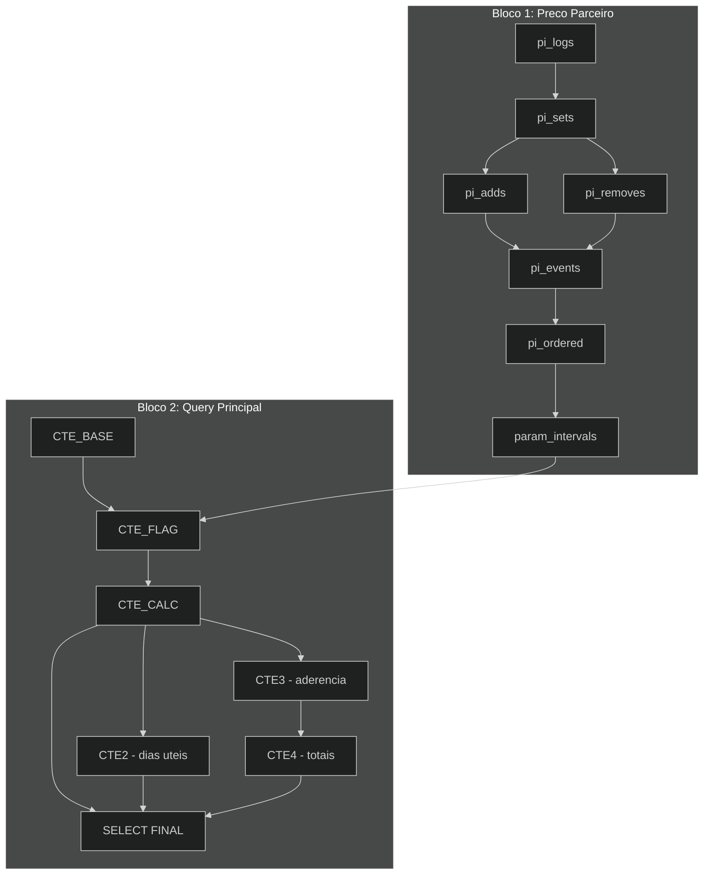
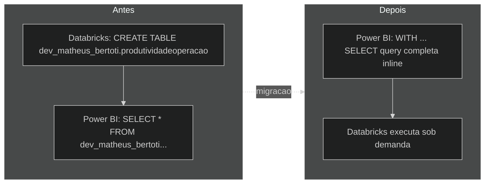

# Painel Produtividade Operação

Este repositório contém a solução completa do dashboard **Produtividade Operação** desenvolvido em Power BI, com fonte de dados no Databricks.

---

## 1. Objetivo de Negócios

O painel fornece indicadores de produtividade dos aprovadores de ordens de serviço (OS) no processo de manutenção de frotas. Ele calcula quantas OSs são aprovadas por dia, ajustando por tipo de manutenção, valores orçados, interações com parceiros, feriados e regras de SLA.

**Usuários:** coordenadores, supervisores, aprovadores e analistas de operações.

---

## 2. Arquitetura

| Camada | Tecnologia | Detalhes |
|--------|-----------|----------|
| **Dados** | Azure Databricks | Catálogo `hive_metastore`, schemas `gold` e `bronze` |
| **ETL/Query** | Spark SQL | Query self-contained com CTEs (sem tabela materializada) |
| **UDF** | Databricks | `dev_charles_barros.fn_calcular_sla_formatado` |
| **Modelagem** | Power BI (TMDL) | Modelo tabular importado |
| **Conexão** | Databricks.Query | Host: `adb-7941093640821140.0.azuredatabricks.net` |
| **Visualização** | Power BI Report | Páginas de visão geral, detalhes e auditoria |

---

## 3. Estrutura da Modelagem

A tabela principal é **FactAprovacao**, carregada por uma query SQL complexa com múltiplas CTEs. Relacionamentos com dimensões de calendário, aprovadores, supervisores, coordenadores e metas.

---

## 4. Tabelas Utilizadas

| Tabela | Schema | Descrição |
|--------|--------|-----------|
| `fact_maintenanceservices` | gold | OSs e timestamps de aprovação |
| `fact_maintenanceitems` | gold | Itens para cálculo de aderência |
| `dim_maintenancevehicles` | gold | Veículos (família, cliente) |
| `dim_maintenancetypes` | gold | Tipo de manutenção |
| `dim_webusers` | gold | Usuários aprovadores (4 joins) |
| `dim_dates` | gold | Calendário com feriados |
| `dim_Maintenanceprotocols` | gold | Protocolos de manutenção |
| `dim_maintenancemerchants` | gold | Estabelecimentos (filtro concessionária) |
| `dim_maintenancelabors` | gold | Tipos de mão de obra |
| `Dim_MaintenanceParameterLogValue` | gold | Log de parâmetros (preço parceiro) |
| `tlbagda_fuel_manutencao_oficina_historico` | bronze | Histórico de interações (revisão/cotação) |

---

## 5. Medidas DAX Principais

| Medida | Fórmula/Descrição |
|--------|-------------------|
| `Tempo Estimado Aprovação` | `7.48 * FactAprovacao[peso_os]` |
| `Dentro SLA` | `sla_aprovocao <= dim_metas.SLA (h)` (calculada em M) |
| `produtividade_semana_aprovador` | soma_peso_os / dias_úteis (calculada em SQL) |
| `peso_os` | `1 / meta_os_dia_corrigido` (calculada em SQL) |

> As demais medidas estão no arquivo `_Medidas.tmdl` do modelo semântico.

---

## 6. Código SQL

A query está disponível em dois formatos:

| Arquivo | Descrição |
|---------|-----------|
| `FactAprovacao.sql` | Versão original com `CREATE TABLE` no schema `dev_matheus_bertoti` |
| `FactAprovacao_DirectQuery.sql` | **Versão atual** - query self-contained sem dependência de schema dev |

### Estrutura das CTEs

---

## 7. Modificações Recentes

| Data | Modificação |
|------|-------------|
| 2026-02-19 | Eliminado schema `dev_matheus_bertoti` e tabela materializada |
| 2026-02-19 | Criada query self-contained `FactAprovacao_DirectQuery.sql` |
| 2026-02-19 | Atualizada partition source no TMDL para usar query direta |
| 2026-02-19 | Versionamento inicial no GitHub |

---

## 8. Notas Adicionais

- O painel **não retorna valores em feriados** ou dias não úteis por design (filtro `dd.HolidayOrBridge`).
- Aprovadores do sábado seguem regra diferente (`WeekDayNumber <= 5` vs `<= 4`).
- Caso o UDF `dev_charles_barros.fn_calcular_sla_formatado` seja removido, será necessário replicar sua lógica inline.

---

> **Repositório:** [EntregaResultados/Painel-Produtividade-Operacao](https://github.com/EntregaResultados/Painel-Produtividade-Operacao)
